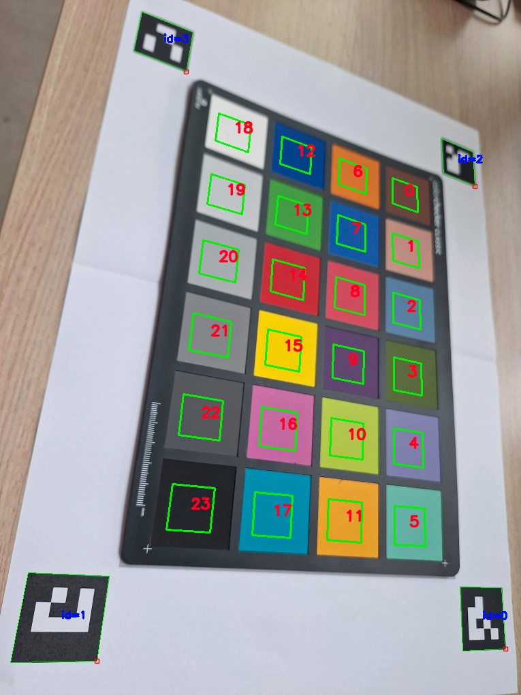

# Arcu ColorChecker
A color check and correction are important steps when setting up a camera.
There are calibration plates on the market, like the ones from pantone, that come with ARCU markers on them.
Unfortunately not all colorcheckers have these, especially the ones that are commonly used in research applications lack any sort of reference. There are matlab applications that can find the xwrite (calbrite) color checkers [mathwork colorchecker](https://nl.mathworks.com/help/images/ref/colorchecker.html), but it would be nice to have an open source python alternative.

This is how the idea to use arcu markers to find and extract colorchecker values was born.
It consists of three steps:
1. Creating the ARCU marker pattern for the color checker
2. Detect the ARCU markers and extract the color values
3. Create a color conversion from the ARCU values to the color checker values

## Configured ColorCheckers
The code is setup to work with the mentioned colorcheckers, however it is worth mentioning that it only take a few changes to add different colorchecker sizes.
The marker patterns can be generated with `create_marker_pdf.py`.

**Calibrite ColorChecker Classic (203 x 292mm)**
The colorchecker itself is the size of an A4, therefore the markers are created on an A3.
To assist in setup, the place to put the colorchecker is marked with a gray square. An example of the printen A3:

  
  

**Calibrite ColorChecker Classic Mini (63.5 x 109mm)**
This colorchecker and markers still fit on an A4.
To assist in setup, the place to put the colorchecker is marked with a gray square. An example of the printen A4:

  
  

The real color values are taken from [X-write support](https://www.xrite.com/service-support/new_color_specifications_for_colorchecker_sg_and_classic_charts)

## Colorchecker detection & correction
As the colorchecker is rectangular it can be placed in two orientations.
Luckily the black square should always be the darkers square in the image, this assumption is used to detect the orientation.
Additionally the size of the markers in the image is used to create a perspective correction, this is not perfect. Therefore the detected squares are delibrately set a few sizes smaller than the color square itself. This still averages over enough pixels to give a reliable color estimate while also giving some margin for correction errors.

After finding the squares and correcting for the orientation the average values are used to create an alfine correction matrix. An important detail here is that the reference values are supplied in the CIELAB color space, openCV uses the CIE color space. Special conversion functions are written to do the entire correction in CIELAB space. 

The following images give an imprssion of the corrected images with the debug markers on them:

  
  

